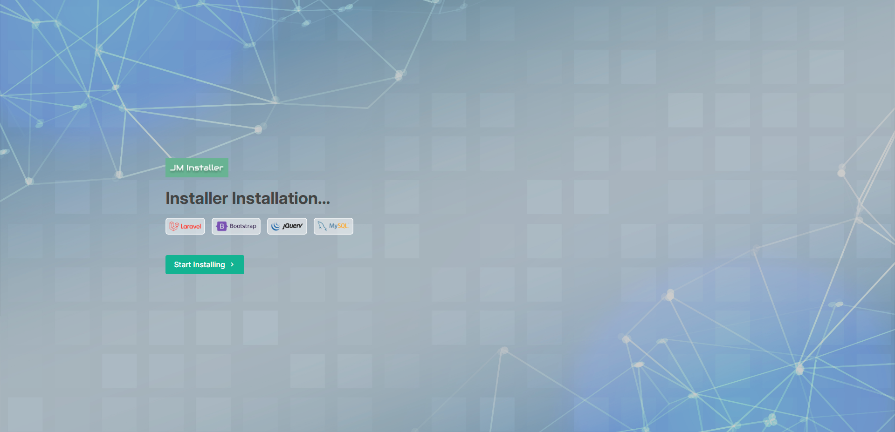
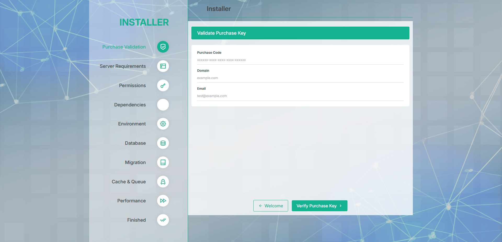
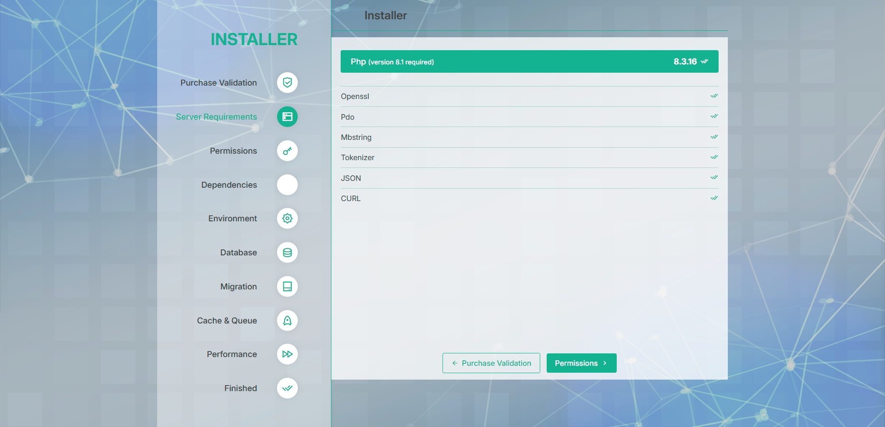
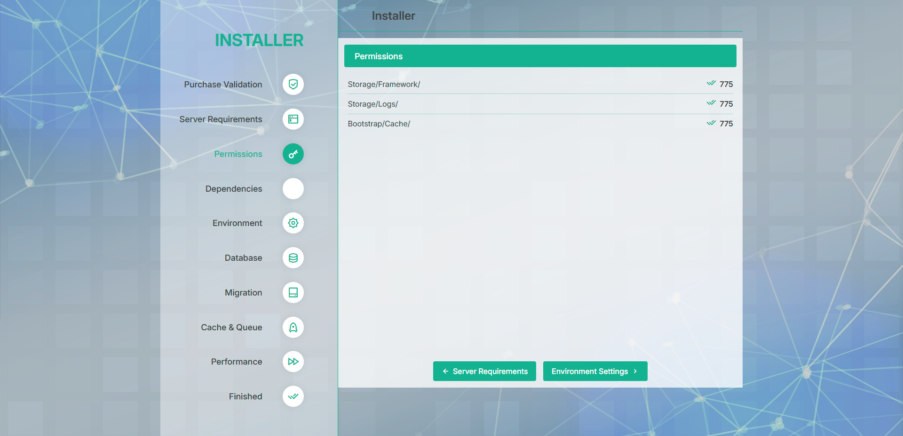
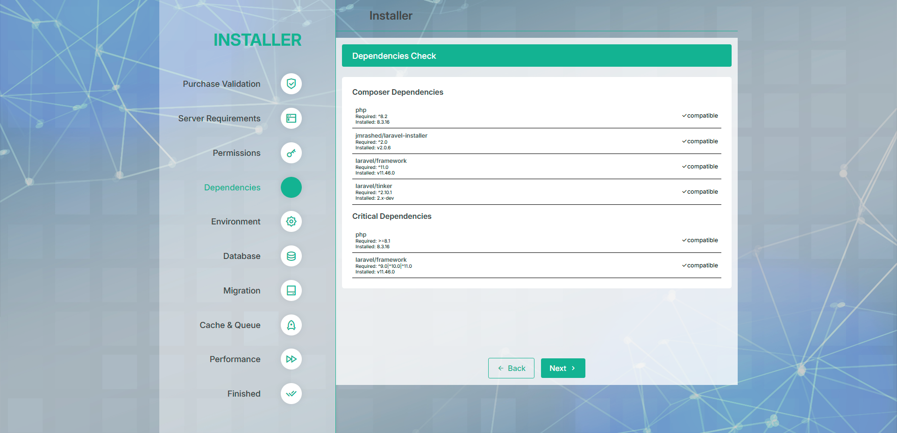
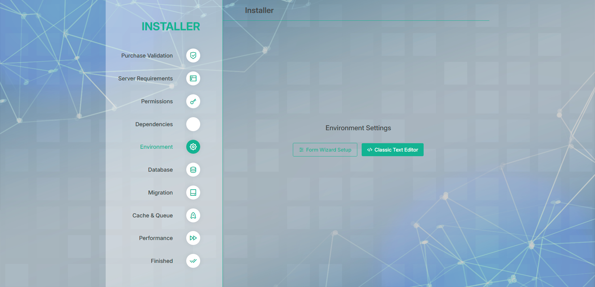
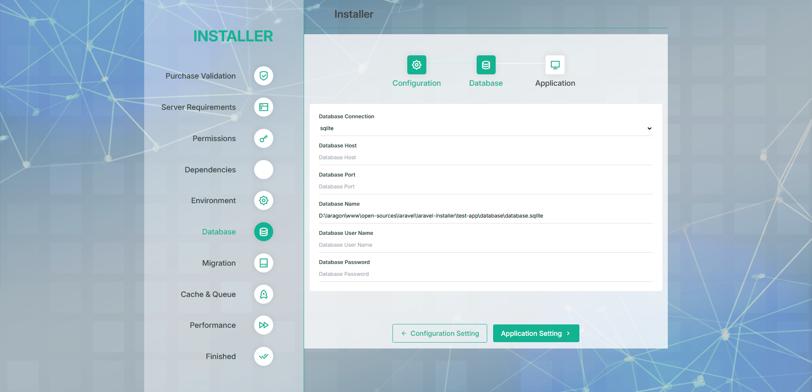
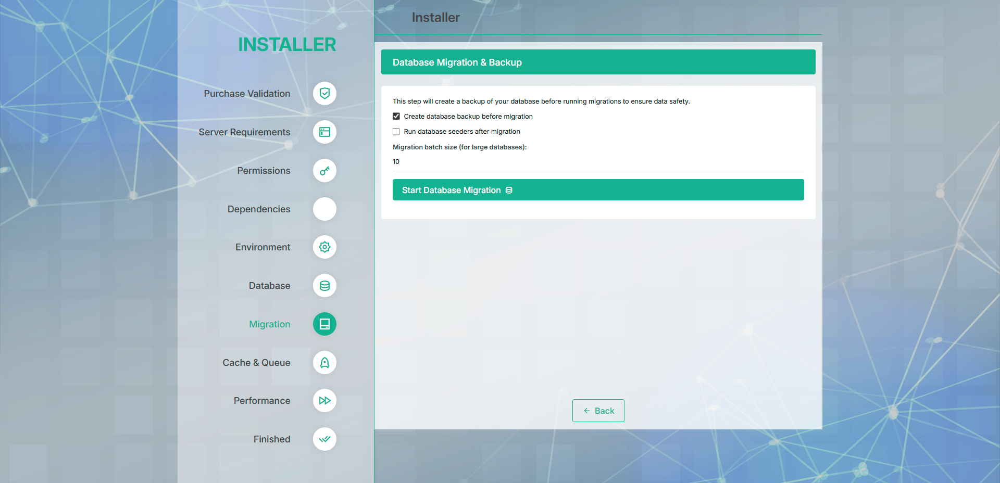
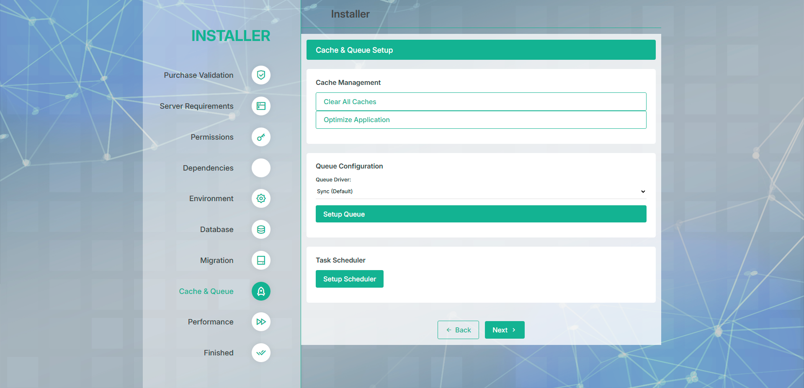
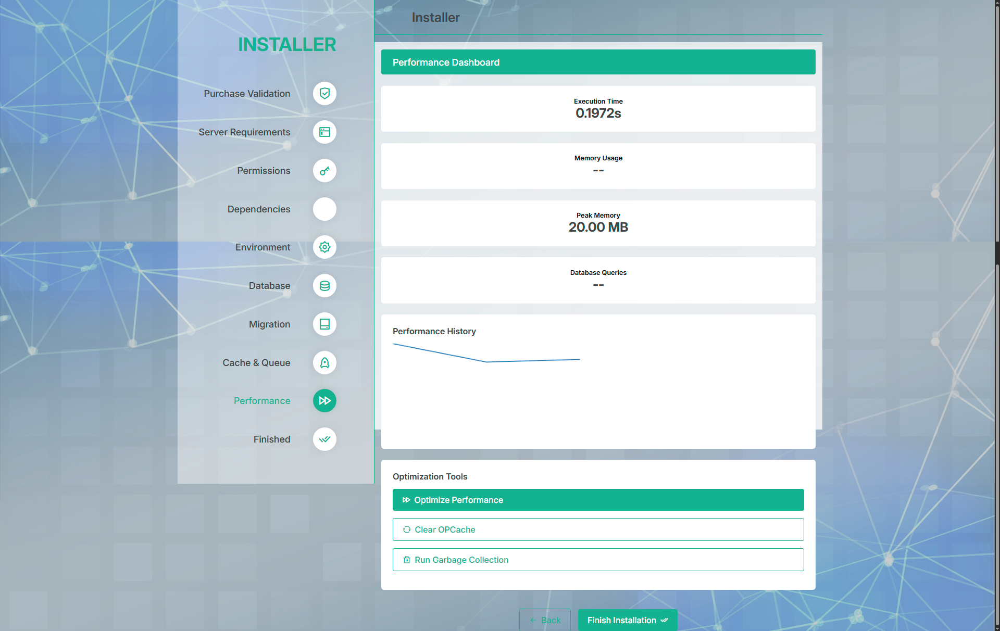

# Laravel Installer v2.0.9

[](https://packagist.org/packages/jmrashed/laravel-installer) [](https://packagist.org/packages/jmrashed/laravel-installer) [](https://packagist.org/packages/jmrashed/laravel-installer) [](https://packagist.org/packages/jmrashed/laravel-installer) [](https://github.com/jmrashed/laravel-installer) [](https://github.com/jmrashed/laravel-installer)

**Laravel Installer v2.0.9** is a complete enterprise-grade package designed to simplify and secure the installation process for Laravel projects. This installer features advanced security, performance monitoring, database backup/recovery, and a comprehensive 9-step installation process.

---

## 🚀 **What's New in v2.0.9**

**v2.0.9 adds Laravel 12 support** (`composer require jmrashed/laravel-installer` was failing to resolve into any new Laravel 12 app before this fix). It builds on **v2.0.8**, a security & stability release: the v2.0.0 security/performance/progress/dependency middleware described below is now actually registered and active on every installer route (previously implemented but not wired in) — see [CHANGELOG.md](CHANGELOG.md) for the full list of fixes, including a command-injection fix in the dependency installer and a permanent license-validation bypass fix.

## 🚀 **What's New in v2.0.0**

### ✅ **Complete 9-Step Installation Process**
1. **Welcome Screen** - Introduction and overview
2. **Server Requirements** - PHP version and extension checks
3. **File Permissions** - Directory permission validation
4. **Dependencies Check** - Composer dependency validation *(NEW)*
5. **Environment Setup** - .env file configuration
6. **Database Configuration** - Database connection setup
7. **Database Backup & Migration** - Automated backup and migration *(NEW)*
8. **Cache & Queue Setup** - Performance optimization *(NEW)*
9. **Performance Dashboard** - Real-time monitoring *(NEW)*

### 🛡️ **Enhanced Security Features**
- **XSS Protection** - Input sanitization and validation
- **Rate Limiting** - IP-based request throttling (20 req/5min)
- **Security Headers** - CSP, Frame Options, XSS Protection
- **Audit Logging** - Comprehensive security event logging
- **Suspicious Content Detection** - Automatic threat detection

### ⚡ **Performance Monitoring**
- **Real-time Metrics** - Execution time, memory usage tracking
- **Performance Dashboard** - Interactive charts and graphs
- **Database Optimization** - Query optimization for large datasets
- **Cache Management** - Automated cache clearing and optimization
- **Memory Optimization** - Garbage collection and memory management

### 🔄 **Resumable Installation**
- **Progress Tracking** - Visual progress indicators
- **State Persistence** - Resume interrupted installations
- **Step Validation** - Prevent skipping required steps
- **Error Recovery** - Automatic rollback on failures

### 💾 **Database Backup & Recovery**
- **Pre-migration Backup** - Automatic database backup
- **Multi-database Support** - MySQL, PostgreSQL, SQLite
- **Rollback Capability** - Restore on migration failures
- **Batch Processing** - Handle large database migrations

---

## 📊 Statistics

- **Total Downloads**: 
- **Monthly Downloads**: 
- **GitHub Stars**: 
- **GitHub Forks**: 

---

## 🌟 Features

### **Core Features**
- ✅ **System Requirements Check** - PHP version and extension validation
- ✅ **Environment File Setup** - Interactive .env configuration
- ✅ **Database Configuration** - Multi-database support with testing
- ✅ **Purchase Code Validation** - Envato marketplace integration
- ✅ **User-Friendly Interface** - Modern responsive design

### **v2.0.0 New Features**
- ✅ **Dependency Management** - Composer package validation and installation
- ✅ **Performance Monitoring** - Real-time metrics and optimization
- ✅ **Security Enhancements** - XSS protection, rate limiting, audit logging
- ✅ **Database Backup/Recovery** - Automated backup with rollback capability
- ✅ **Cache & Queue Setup** - Redis, database, sync queue configuration
- ✅ **Progress Tracking** - Resumable installation with state persistence
- ✅ **Multi-language Support** - English translations are complete; 18 additional locales are scaffolded with partial coverage (contributions welcome, see [CONTRIBUTING.md](CONTRIBUTING.md))
- ✅ **API Endpoints** - RESTful APIs for all installation operations

---

## 🛠️ Installation

### **Step 1: Install Package**
```bash
composer require jmrashed/laravel-installer
```

### **Step 2: Publish Configuration**
```bash
php artisan vendor:publish --provider="Jmrashed\LaravelInstaller\Providers\LaravelInstallerServiceProvider"
php artisan vendor:publish --tag=installer-config
```

### **Step 3: Publish Assets (Optional)**
```bash
php artisan vendor:publish --tag=laravelinstaller --force
```

---

## 🚀 How to Use

### **Web Interface**
Navigate to `/install` in your browser to start the installation wizard.

### **Command Line**
```bash
php artisan installer:run
```

### **Clear Installer Caches**
```bash
php artisan installer:clear-caches
```

## Demo Screenshots





















---

## 🔧 **API Endpoints**

### **Progress Tracking**
- `GET /install/api/progress` - Get installation progress
- `POST /install/api/progress/update` - Update progress step

### **Dependencies**
- `GET /install/api/dependencies/check` - Check dependencies
- `POST /install/api/dependencies/install` - Install packages

### **Performance**
- `GET /install/api/performance/metrics` - Get real-time metrics
- `POST /install/api/performance/optimize` - Optimize performance

### **Database**
- `POST /install/api/database/migrate` - Run migrations with backup
- `POST /install/api/database/rollback` - Rollback to backup

### **Cache & Queue**
- `POST /install/api/cache/clear` - Clear all caches
- `POST /install/api/queue/setup` - Configure queue drivers

---

## 🛡️ **Security Features**

### **Input Validation**
```php
// All inputs are sanitized and validated
$sanitizedInput = SecurityHelper::sanitizeInput($request->input());
```

### **Rate Limiting**
```php
// IP-based rate limiting (20 requests per 5 minutes)
RateLimiter::attempt('installer:' . $request->ip(), 20, 300);
```

### **Security Headers**
- `X-Content-Type-Options: nosniff`
- `X-Frame-Options: DENY`
- `X-XSS-Protection: 1; mode=block`
- `Content-Security-Policy: default-src 'self'`

---

## ⚡ **Performance Features**

### **Real-time Monitoring**
```javascript
// Performance metrics are tracked automatically
fetch('/install/api/performance/metrics')
  .then(response => response.json())
  .then(data => {
    console.log('Execution Time:', data.execution_time);
    console.log('Memory Usage:', data.memory_used);
  });
```

### **Database Optimization**
```php
// Large database handling
DatabaseOptimizer::optimizeForLargeDatabase();
DatabaseOptimizer::runMigrationsInBatches(10);
```

---

## 💾 **Database Backup**

### **Automatic Backup**
```php
// Backup is created automatically before migrations
$backupId = DatabaseBackupManager::createBackup();
```

### **Manual Rollback**
```php
// Rollback to previous state
DatabaseBackupManager::restoreBackup($backupId);
```

---

## 🔄 **Progress Tracking**

### **Check Progress**
```php
$progress = ProgressTracker::getProgress();
echo "Current Step: " . $progress['current_step'];
echo "Completion: " . $progress['completion_percentage'] . "%";
```

### **Resume Installation**
```php
if (ProgressTracker::canResume('database')) {
    // Continue from database step
}
```

---

## 🌐 **Envato Integration**

### **API Configuration**
```php
// Update API endpoints in PurchaseController
$envatoApiTokenUrl = 'https://your-domain.com/api/get-envato-barrier-token';
$envatoApiStoreUrl = 'https://your-domain.com/api/store-envato-verification-response';
```

### **Sample API Response**
```json
{
  "message": "Welcome to the Envato Purchase Validation API",
  "account1": {
    "token": "fsHuTBwXZTlEqZYQacniBeNZFCrT01eZ"
  },
  "validation": {
    "url": "https://api.envato.com/v3/market/author/sale"
  }
}
```

---

## 📂 **v2.0.0 Directory Structure**

```text
src/
├── Commands/
│   ├── ClearInstallerCaches.php
│   └── InstallerRunCommand.php
├── Config/
│   ├── installer.php
│   ├── audit.php
│   └── logging.php
├── Controllers/
│   ├── CacheQueueController.php      # NEW
│   ├── DatabaseController.php        # ENHANCED
│   ├── DependencyController.php      # NEW
│   ├── PerformanceController.php     # NEW
│   ├── ProgressController.php        # NEW
│   └── [existing controllers...]
├── Helpers/
│   ├── BackupManager.php            # NEW
│   ├── CacheQueueManager.php        # NEW
│   ├── DatabaseBackupManager.php    # NEW
│   ├── DependencyChecker.php        # NEW
│   ├── PerformanceMonitor.php       # NEW
│   ├── ProgressTracker.php          # NEW
│   ├── SecurityHelper.php           # NEW
│   └── [existing helpers...]
├── Middleware/
│   ├── SecurityMiddleware.php       # NEW
│   ├── PerformanceMiddleware.php    # NEW
│   ├── ProgressMiddleware.php       # NEW
│   ├── DependencyMiddleware.php     # NEW
│   └── [existing middleware...]
├── Views/
│   ├── dependencies.blade.php       # NEW
│   ├── performance-dashboard.blade.php # NEW
│   ├── cache-queue.blade.php        # NEW
│   ├── database-backup.blade.php    # NEW
│   ├── resume-installation.blade.php # NEW
│   └── [existing views...]
└── Routes/
    ├── web.php                      # ENHANCED
    └── backup.php                   # NEW
```

---

## 🔧 System Requirements

### **Minimum Requirements**
- **PHP**: 8.1 or higher
- **Laravel**: 9.0 or higher
- **Memory**: 128MB minimum, 512MB recommended
- **Disk Space**: 50MB for package files

### **Required PHP Extensions**
- `mbstring` - String manipulation
- `openssl` - Encryption and security
- `pdo` - Database connectivity
- `tokenizer` - Code parsing
- `xml` - XML processing
- `ctype` - Character type checking
- `json` - JSON processing
- `curl` - HTTP requests (for Envato API)

### **Optional Extensions**
- `redis` - For Redis queue/cache support
- `opcache` - For performance optimization
- `zip` - For backup compression

---

## 🚀 **Release Information**

### **Version**: v2.0.9
### **Release Date**: 2026-07-28
### **Status**: Production Ready
### **Breaking Changes**: No (security/bug-fix release, see [CHANGELOG.md](CHANGELOG.md))

### **Upgrading to v2.0.9**
```bash
# Backup your current installation
cp -r vendor/jmrashed/laravel-installer vendor/jmrashed/laravel-installer-backup

# Update the package
composer update jmrashed/laravel-installer

# Republish configuration (adds the new installer.security.* and
# installer.purchase_validation.* config keys)
php artisan vendor:publish --tag=installer-config --force
```

If you were relying on the v2.0.x security/performance/progress/dependency
middleware being present-but-inactive, note that as of v2.0.9 they are
registered on every installer route by default — see
[CHANGELOG.md](CHANGELOG.md) for details before upgrading a
publicly-reachable deployment.

---

## 🤝 Contributing

Contributions are welcome! Please follow these steps:

1. Fork the repository
2. Create a feature branch: `git checkout -b feature/amazing-feature`
3. Commit changes: `git commit -m 'Add amazing feature'`
4. Push to branch: `git push origin feature/amazing-feature`
5. Open a Pull Request

---

## 📝 License

This package is licensed under the [MIT License](LICENSE).

---

## 📬 Support

- **GitHub Issues**: [Report bugs and request features](https://github.com/jmrashed/laravel-installer/issues)
- **Documentation**: [Full documentation](https://github.com/jmrashed/laravel-installer/wiki)
- **Email Support**: Contact us directly for enterprise support

---

## Author

**Md Rasheduzzaman**  
Full-Stack Software Engineer & Technical Project Manager  

Building scalable, secure & AI-powered SaaS platforms across ERP, HRMS, CRM, LMS, and E-commerce domains.  
Over 10 years of experience leading full-stack teams, cloud infrastructure, and enterprise-grade software delivery.

**🌐 Portfolio:** [jmrashed.github.io](https://jmrashed.github.io/)  
**✉️ Email:** [jmrashed@gmail.com](mailto:jmrashed@gmail.com)  
**💼 LinkedIn:** [linkedin.com/in/jmrashed](https://www.linkedin.com/in/jmrashed/)  
**📝 Blog:** [medium.com/@jmrashed](https://medium.com/@jmrashed)  
**💻 GitHub:** [github.com/jmrashed](https://github.com/jmrashed)

---

> *“Need a Reliable Software Partner? I build scalable, secure & modern solutions for startups and enterprises.”*